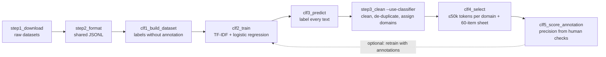

# Domain classifiers for Nigerian Pidgin and Igbo

Text-domain classification and domain-balanced dataset construction for two Nigerian languages,
**Nigerian Pidgin (`pcm`)** and **Igbo (`ibo`)**.

One codebase trains a **separate model per language**. Each model sorts text into five domains:

- `education`
- `health`
- `telecommunications`
- `finance`
- `law`

Anything else is labelled `other`.

The models are then used to build a **dataset of up to 50,000 tokens per domain** for each
language, together with a **60-item annotation sheet** (10 per domain and 10 `other`) for human
verification.

This work is part of the CMU-Africa MSIT practicum with **Intron**, on offline multilingual spoken
question answering in African languages. The domain-labelled text feeds question-answer
generation and punctuation/capitalisation work downstream.

---

## Contents

1. [Quick start](#1-quick-start)
2. [How it works](#2-how-it-works)
3. [Data sources](#3-data-sources)
4. [Where the training labels come from](#4-where-the-training-labels-come-from)
5. [Model](#5-model)
6. [Evaluation](#6-evaluation)
7. [Final dataset (50,000 tokens per domain)](#7-final-dataset-50000-tokens-per-domain)
8. [Annotation guide](#8-annotation-guide)
9. [Outputs](#9-outputs)
10. [Repository structure](#10-repository-structure)
11. [Configuration](#11-configuration)
12. [Results](#12-results)
13. [Limitations](#13-limitations)
14. [Pushing results to GitHub](#14-pushing-results-to-github)
15. [Reproducibility](#15-reproducibility)
16. [Data sources and citations](#16-data-sources-and-citations)
17. [Authors and acknowledgements](#17-authors-and-acknowledgements)

---

## 1. Quick start

### Google Colab (recommended)

1. Open `notebooks/domain_classifier_colab.ipynb` in Colab. Use **File → Upload notebook**, or
   **File → Open notebook → GitHub** once this repository is pushed.
2. Go to **Runtime → Change runtime type → T4 GPU** (needed for the zero-shot teacher).
3. In the *Settings* cell, set `LANG = "pcm"` or `LANG = "ibo"`. After pushing, also set `REPO_URL`
   to this repository's URL. Leave it empty to upload the code as a zip instead.
4. Run the cells top to bottom. One language takes about 30–45 minutes on a T4.
5. Download `<lang>_results.zip`. It contains the final dataset, the annotation sheet, the model and the reports.
6. Repeat with the other language: change `LANG`, choose **Runtime → Restart session**, and run again.

### Local machine (Python ≥ 3.10)

```bash
pip install -r requirements.txt
bash run_classifier.sh pcm               # Nigerian Pidgin, without the teacher (CPU is fine)
bash run_classifier.sh ibo --teacher     # Igbo, with the teacher (needs: pip install transformers torch sentencepiece)
```

Every script takes `--lang pcm` or `--lang ibo`. Run any script with `-h` for its options.

---

## 2. How it works



| Step | Script | What it does |
|---|---|---|
| 1 | `step1_download.py` | Downloads the language's sources from GitHub and Hugging Face into `data/raw/`. If one source fails, the others still download. |
| 2 | `step2_format.py` | Converts every source to the shared JSONL schema and splits documents into records of whole sentences (≤120 tokens). Keeps each source's own topic labels. |
| 3 | `clf1_build_dataset.py` | Builds the train, dev and test sets **without manual annotation** (see §4). |
| 4 | `clf2_train.py` | Trains the classifier, tunes per-domain confidence thresholds, and evaluates against the keyword-rule baseline. |
| 5 | `clf3_predict.py` | Labels every text. |
| 6 | `step3_clean.py --use-classifier` | Cleans the text and drops English or other-language records and near-duplicates. Assigns the final domains: human labels are kept, the classifier decides the rest. |
| 7 | `step4_validate_schema.py` | Checks every record against the shared schema. |
| 8 | `clf4_select.py` | Selects up to 50,000 tokens per domain and writes the 60-item annotation sheet. |
| 9 | `clf5_score_annotation.py` | Scores the filled annotation sheet: precision per domain with 95% intervals. |

`step5_stats.py` through `step8_presentation_table.py` and `run_all.sh` are the earlier data-audit
tools. They produce punctuation statistics, manual review samples and a per-dataset summary table, and are optional for the classifier.

---

## 3. Data sources

### Nigerian Pidgin (`pcm`)

| Source | Host | Licence | Labels used |
|---|---|---|---|
| MasakhaNEWS (pcm) | GitHub | AFL-3.0 (HF metadata) / CC BY-NC 4.0 (card text), conflicting | Human topic labels: business→finance, health; politics, sports, entertainment→other |
| MAFAND-MT en-pcm (Pidgin side) | GitHub | CC BY-NC 4.0 | none (single sentences) |
| UD Naija-NSC (orthographic transcripts of speech) | GitHub | CC BY-SA 4.0 | Recording titles, e.g. *Education*, *Insurance* |
| XL-Sum (pidgin) | Hugging Face | CC BY-NC-SA 4.0 | none |
| Wikipedia (pcm, 2023-11-01) | Hugging Face | CC BY-SA 4.0 | none |
| FineWeb-2 (pcm_Latn) | Hugging Face | ODC-By 1.0 | none |

### Igbo (`ibo`)

| Source | Host | Licence | Labels used |
|---|---|---|---|
| MasakhaNEWS (ibo) | GitHub | AFL-3.0 / CC BY-NC 4.0, conflicting | Human topic labels: business→finance, health; politics, sports, entertainment, religion→other |
| MAFAND-MT en-ibo (Igbo side) | GitHub | CC BY-NC 4.0 | none |
| IgboNLP: BBC Igbo, Igbo Radio | GitHub | **No licence stated** | none (tokenised text, re-joined automatically) |
| Common Voice Igbo sentences | GitHub | CC0 | none; used for training, **excluded from the final dataset** (weak punctuation) |
| XL-Sum (igbo) | Hugging Face | CC BY-NC-SA 4.0 | none |
| WURA (ibo, documents) | Hugging Face | Apache-2.0 | categories only when they map directly to a domain |
| Wikipedia (ig, 2023-11-01) | Hugging Face | CC BY-SA 4.0 | none |
| FineWeb-2 (ibo_Latn) | Hugging Face | ODC-By 1.0 | none |

**Considered but not used:**
- JW300 and IgboNLP JW texts: copyright, and religious only.
- IgboNLP novels: outside the five domains.
- AfriSenti tweets: no domains, informal punctuation.
- MasakhaNER: duplicates the same news.
- AfriSpeech-200: English, not Pidgin.
- FLORES-200: kept for evaluation only.

---

## 4. Where the training labels come from

No new annotation is needed to train. Labels come from three places, strongest first:

| Label | Source | Used for |
|---|---|---|
| **Human (gold)** | Topic labels curated by people: MasakhaNEWS categories and UD Naija recording titles. Topics outside the five domains become `other`. | train, dev, **test** |
| **Teacher** (`--teacher nli`) | A zero-shot multilingual NLI model labels unlabeled texts it is ≥70% confident about. Texts containing at least one domain keyword are sent first, so rare domains get candidates. | train |
| **Weak** | Keyword rules (`DOMAIN_KEYWORDS` in `langs/<lang>.py`). A label needs ≥3 hits from ≥2 different keywords and a 1.5× lead over the next domain. | train |

**Splits:**
- **test:** human labels only, from the MasakhaNEWS `test` split and all UD Naija titled recordings.
- **dev:** human labels from the MasakhaNEWS `dev` split.
- **train:** everything else that has a label.

**Leakage control:** a training text is removed if at least 50% of its tokens are in sentences that also appear in a dev or test article. This matters because XL-Sum and WURA re-publish BBC articles that are also in MasakhaNEWS.

Matching for keywords and features ignores case and diacritics, so ị/i, ọ/o, ụ/u, ṅ/n and tone
marks are treated the same. The stored text keeps every diacritic.

---

## 5. Model

**Classifier (`clf2_train.py`, saved to `models/<lang>_domain_clf.joblib`):**

- **Features:** TF-IDF on word 1–2-grams (up to 200k features) plus character 3–5-grams within
  word boundaries (up to 300k). Applied to lower-cased, diacritic-folded text.
- **Model:** multinomial logistic regression with balanced class weights. The regularisation
  strength C ∈ {1, 4, 16} is chosen on dev macro-F1.
- **Sample weights:** human 1.0, teacher 0.8, keyword 0.5.
- **Keyword masking:** for keyword-labelled texts, about 50% of the domain keywords are deleted
  during training. This makes the model learn the surrounding context rather than copying the rules.
- **Per-domain confidence thresholds:** a text gets a domain only if the model's probability is
  at least that domain's threshold; otherwise it is `other`. Thresholds are tuned on dev for
  domains with human dev labels. Domains without them use a stricter 0.6 (`--unmeasured-threshold`).
- **Speed:** trains in about 1–3 minutes on CPU, and prediction needs no GPU.
- **Alternative:** `--embed intfloat/multilingual-e5-base` replaces the TF-IDF features with
  sentence embeddings (needs `sentence-transformers`).

**Teacher (`clf1_build_dataset.py --teacher nli`):**

- **Model:** [`MoritzLaurer/mDeBERTa-v3-base-mnli-xnli`](https://huggingface.co/MoritzLaurer/mDeBERTa-v3-base-mnli-xnli),
  used through the Hugging Face zero-shot-classification pipeline.
- **Hypothesis template:** "This text is about {}." Candidate labels are short English
  descriptions of each domain, plus decoy topics (politics, sports, entertainment, religion) so off-topic text has somewhere to go.
- **Role:** it produces training labels only. It is not part of the saved model.

---

## 6. Evaluation

| Check | Where | What it measures |
|---|---|---|
| **Human-label test set** | `reports/<lang>_clf_report.md` | Precision, recall and F1 per domain and macro-F1 on human labels, compared with the keyword rules. Covers only domains that have human labels (mainly health, finance and `other`; education for Pidgin via UD Naija). |
| **Masked-silver check** | same report | Recall on held-out keyword-labelled texts **after deleting every keyword**. Well above zero means the model uses context, not just the keywords. |
| **Annotation (60 items)** | `reports/<lang>_annotation_score.md` | Precision per predicted domain on the final dataset, with Wilson 95% intervals. This is the only measurement for telecommunications, law and (for Igbo) education. |

With 10 items per domain the interval is wide, about ±25 points. Treat the annotation as a
sanity check, or annotate more with `clf4_select.py --per-domain 20`.

---

## 7. Final dataset (50,000 tokens per domain)

`clf4_select.py` writes `data/final/<lang>_domain_dataset.jsonl`. For each domain it selects records in this order until the target (`--tokens`, default 50,000) is reached:

1. records whose domain comes from a **human label**;
2. then **classifier-labelled** records, highest confidence first.

**Never selected:**
- records rejected in a manual review (`review_status = rejected`);
- sources marked `in_final_dataset = False` (Common Voice for Igbo).

If a domain has less text than the target, everything available is kept, and
`reports/<lang>_final_dataset.md` reports the shortfall.

**Record format** (the team's shared schema):

```json
{"id": "pcm_health_0001", "language": "pcm", "domain": "health", "raw_text": "...",
 "source_dataset": "masakhanews_pcm", "source_split": "train", "license": "...",
 "review_status": "unreviewed",
 "notes": "doc=...; domain_method=source_label|recording_title|classifier; clf_prob=0.87; langcheck=pcm"}
```

---

## 8. Annotation guide

**The sheet:** `reviews/<lang>_annotation.xlsx` has 60 items:
- 10 per domain, drawn from the classifier-labelled part of the final dataset;
- 10 texts the classifier put in `other`.

Short texts (one or two sentences, ≤40 words) are preferred so each item is quick to judge.

| Column | Fill in |
|---|---|
| `correct` | `Y` if the `predicted` domain is right, `N` if not |
| `true_domain` | Only when `correct = N`: the right domain from the drop-down (`other` = none of the five) |
| `comment` | Optional, e.g. "mostly English", "about elections" |

**Rules:**
- **Judge the topic of the text itself,** not the source it came from.
- **Use the main topic.** A court case about a hospital is `law` if the text is mainly about the court.
- **Don't edit `id`, `text` or `predicted`.**

Score the filled sheet with `python clf5_score_annotation.py --lang <lang>`. Optionally retrain
on it with `python clf2_train.py --lang <lang> --gold reviews/<lang>_annotation.xlsx --train-on-gold`.
That adds half of the annotated items to training and keeps half in the test set.

`clf4_select.py` will not overwrite a sheet that already has answers. Use `--new-sheet` to replace it.

---

## 9. Outputs

| File | Content |
|---|---|
| `data/final/<lang>_domain_dataset.jsonl` | Final dataset, ≤50k tokens per domain |
| `models/<lang>_domain_clf.joblib` | Trained classifier: model, classes, thresholds, domain list |
| `reviews/<lang>_annotation.xlsx` | 60-item annotation sheet |
| `reports/<lang>_clf_dataset.md` | Training-data counts per domain and label source |
| `reports/<lang>_clf_report.md` / `.csv` | Test scores, comparison with keyword rules, confusion matrix, masked-silver check |
| `reports/<lang>_clf_coverage.md` | Tokens per domain: keyword rules vs classifier |
| `reports/<lang>_final_dataset.md` / `.csv` | Tokens selected per domain, target met or not, label sources, data sources |
| `reports/<lang>_annotation_score.md` / `.csv` | Precision per domain from the annotation |
| `data/clean/<lang>_clean.jsonl` | Full cleaned corpus with domains (before the 50k selection) |

To load the model in Python:

```python
import joblib, sys
sys.argv = ["x", "--lang", "pcm"]            # config.py reads the language from the command line
from clf_models import decide
from common import fold
b = joblib.load("models/pcm_domain_clf.joblib")
texts = ["Doctors for di hospital sey malaria still dey kill pikin."]
print(decide(b["model"].proba([fold(t) for t in texts]), b["model"].classes_, b["threshold"]))
```

---

## 10. Repository structure

```
.
├── README.md
├── requirements.txt
├── config.py                  shared settings; picks the language (--lang) and domains
├── langs/
│   ├── pcm.py                 Pidgin: sources, domains, keyword lists, language markers
│   └── ibo.py                 Igbo:   sources, domains, keyword lists, language markers
├── common.py                  cleaning, tokenising, keyword matching, statistics
├── clf_models.py              model classes (TF-IDF / embeddings + logistic regression)
├── step1_download.py          download sources
├── step2_format.py            convert to the shared JSONL schema
├── clf1_build_dataset.py      training data without annotation (+ optional teacher)
├── clf2_train.py              train + evaluate
├── clf3_predict.py            label every text
├── step3_clean.py             clean, language-check, de-duplicate (--use-classifier)
├── step4_validate_schema.py   schema check
├── clf4_select.py             final ≤50k-per-domain dataset + annotation sheet
├── clf5_score_annotation.py   score the annotation
├── run_classifier.sh          steps above in one command
├── notebooks/
│   └── domain_classifier_colab.ipynb
├── step5_stats.py … step8_presentation_table.py, run_all.sh   data-audit tools (optional)
├── reports/                   (generated) reports
├── reviews/                   (generated) annotation sheets
├── models/                    (generated) trained models
└── data/                      (generated, git-ignored) raw, formatted, clean and final text
```

---

## 11. Configuration

- **Domains:** `TARGET_DOMAINS` in `langs/pcm.py` and `langs/ibo.py`, currently the same five for both.
  You can also override them for one run with `--domains a,b,c`, but pass it to every step.
- **Token target:** `TARGET_TOKENS_PER_DOMAIN` in `config.py` (50,000), or `clf4_select.py --tokens N`.
- **Keyword lists:** `DOMAIN_KEYWORDS` in `langs/<lang>.py`. These have the biggest effect on rare
  domains. The Igbo lists were drafted for this project and **should be reviewed by a native speaker**.
- **Thresholds:**
  - keyword rules: `DOMAIN_MIN_HITS`, `DOMAIN_MIN_DISTINCT`, `DOMAIN_MIN_MARGIN` in `config.py`;
  - classifier confidence: `clf2_train.py --unmeasured-threshold`;
  - teacher confidence: `clf1_build_dataset.py --teacher-threshold`.
- **Sources:** `SOURCES` in `langs/<lang>.py`. Set `"in_final_dataset": False` to train on a source without delivering it.
- **Adding a language:**
  1. Copy `langs/ibo.py` to `langs/<code>.py`.
  2. Change the sources, keyword lists and language markers.
  3. Run with `--lang <code>`.

---

## 12. Results

> Copy the numbers from `reports/<lang>_clf_report.md`, `reports/<lang>_final_dataset.md` and
> `reports/<lang>_annotation_score.md` after the full Colab run (all sources, teacher on).

### Full run (fill in)

| | Pidgin (`pcm`) | Igbo (`ibo`) |
|---|---:|---:|
| Classifier macro-F1, human-label test set | | |
| Keyword-rules macro-F1, same test set | | |
| Annotation accuracy (60 items) | | |
| Tokens, education | / 50,000 | / 50,000 |
| Tokens, health | / 50,000 | / 50,000 |
| Tokens, telecommunications | / 50,000 | / 50,000 |
| Tokens, finance | / 50,000 | / 50,000 |
| Tokens, law | / 50,000 | / 50,000 |

### Development run (GitHub-hosted sources only, no teacher, 4 Oct 2026)

These numbers check the code on a subset. Replace them with the full run.

| | Pidgin | Igbo |
|---|---:|---:|
| Classifier macro-F1, human-label test | **0.66** (MasakhaNEWS part 0.87) | **0.77** |
| Keyword-rules macro-F1 | 0.53 (0.66) | 0.59 |
| F1, health (classifier vs keywords) | 0.78 vs 0.53 | 0.81 vs 0.61 |
| F1, finance | 0.71 vs 0.49 | 0.62 vs 0.34 |
| F1, education (30 UD Naija speech transcripts) | 0.21 vs 0.23 | n/a |
| Tokens selected: education / health / telecoms / finance / law | 12k / 50k / 0.1k / 50k / 2.7k | 26k / 50k / 1.2k / 50k / 50k |

On this subset, telecommunications is the bottleneck for both languages. The full run adds the
Hugging Face text, which is the larger share, and teacher labels.

---

## 13. Limitations

- **Domains without human labels are measured only by the 60-item annotation.** This applies to
  telecommunications, law and (for Igbo) education, and the annotation's intervals are wide.
- **Telecommunications text is scarce in both languages,** so the 50k target may not be reachable
  from public data. Options: Intron's own text, translation, or generated data.
- **The teacher is weaker for Igbo.** Its NLI training data (MNLI/XNLI) contains neither Igbo nor
  Pidgin. Pidgin benefits from its closeness to English. For Igbo, keyword rules and MasakhaNEWS labels carry more weight.
- **Police and arrest keywords count towards law,** so crime news is labelled `law`. Remove them
  from `DOMAIN_KEYWORDS` if `law` should mean courts and legislation only.
- **MAFAND records are single sentences,** which carry little context.
- **Licences:**
  - MasakhaNEWS, MAFAND and XL-Sum are **non-commercial**.
  - IgboNLP states **no licence**.
  - Confirm with Intron before any commercial use, and **do not redistribute `data/`** without checking each source's licence.

---

## 14. Pushing results to GitHub

`.gitignore` excludes `data/` (raw and derived text, licence-restricted), caches and zip files.
Reports, annotation sheets and trained models (~10–30 MB each) are committed.

```bash
# 1. unzip the Colab results into this folder (they land in data/, models/, reports/, reviews/)
unzip pcm_results.zip -d .
unzip ibo_results.zip -d .

# 2. first push
git init
git add .
git commit -m "Domain classifiers for Nigerian Pidgin and Igbo"
git branch -M main
git remote add origin https://github.com/<your-username>/pcm-ibo-domain-classifier.git
git push -u origin main
```

**Notes:**
- Fill in the *Results* table (§12) before pushing.
- Add a code licence (e.g. MIT) if the repository will be public.
- If a model file exceeds 100 MB, use [Git LFS](https://git-lfs.com/), or host the models on the Hugging Face Hub.

---

## 15. Reproducibility

- **Seeds:** dataset building 13, training 13, selection 21, and the annotation sample is drawn with seed 21.
  Each script accepts `--seed`.
- **Determinism:** IDs are assigned deterministically, in source-priority order and then input order.
- **Versions:** results depend on the Hugging Face dataset versions downloaded on the day.
  Wikipedia is pinned to the 2023-11-01 dump. The other sources follow their repositories' current version.
- **Environment:** Python 3.10–3.12 with the packages in `requirements.txt`. The teacher was used
  through `transformers` on a Colab T4 GPU.

---

## 16. Data sources and citations

Please cite the datasets you use:

- **MasakhaNEWS:** Adelani et al. (2023). *MasakhaNEWS: News Topic Classification for African Languages.* IJCNLP-AACL.
- **MAFAND-MT:** Adelani et al. (2022). *A Few Thousand Translations Go a Long Way! Leveraging Pre-trained Models for African News Translation.* NAACL.
- **UD Naija-NSC:** Caron et al. (2019). *A Surface-Syntactic UD Treebank for Naija.* TLT.
- **XL-Sum:** Hasan et al. (2021). *XL-Sum: Large-Scale Multilingual Abstractive Summarization for 44 Languages.* Findings of ACL.
- **WURA:** Oladipo et al. (2023). *Better Quality Pre-training Data and T5 Models for African Languages.* EMNLP.
- **IgboNLP:** Ezeani et al. (2020). *Igbo-English Machine Translation: An Evaluation Benchmark.* arXiv:2004.00648.
- **FineWeb-2:** Penedo et al. (2025). *FineWeb2: One Pipeline to Scale Them All.*
- **Common Voice:** Ardila et al. (2020). *Common Voice: A Massively-Multilingual Speech Corpus.* LREC.
- **Teacher model:** Laurer et al., `MoritzLaurer/mDeBERTa-v3-base-mnli-xnli` (Hugging Face); He et al. (2021), *DeBERTaV3*.

---

## 17. Authors and acknowledgements

**Author:** Ukachi Agnes Eze-Mbey, Carnegie Mellon University Africa.

**Context:** MSIT Practicum (04-900A) with **Intron**.

**Practicum team:**
- Michael Sangwa
- Peter Adeyemo
- Rose Mwiseneza
- Ukachi Agnes Eze-Mbey

**Thanks:** the creators of the datasets listed above.
